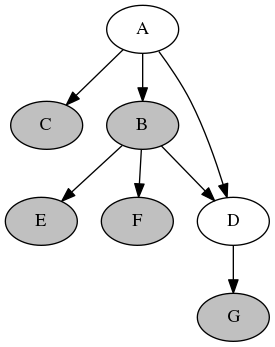

# depend
simple library for dependency

[](https://landscape.io/github/liuyang1/depend/master)
[](https://www.codacy.com/app/lujing-zui/depend?utm_source=github.com&amp;utm_medium=referral&amp;utm_content=liuyang1/depend&amp;utm_campaign=Badge_Grade)!




## How to use it?

check `test.py`

## Internal Technology

simple topological sort

## How to visulize it?

Use `graphviz` to visulize the dependency.

We have two functions:

- `showDot`

    generate `dot` file format with dependency graph.

- `showDotWithSt`

    generate `dot` file format with dependency grapha, render disabled feature with gray color.

When have `dot` file, we could generate the picture by this command:

```
dot -Tpng [file.dot] -o [file.png]
```
